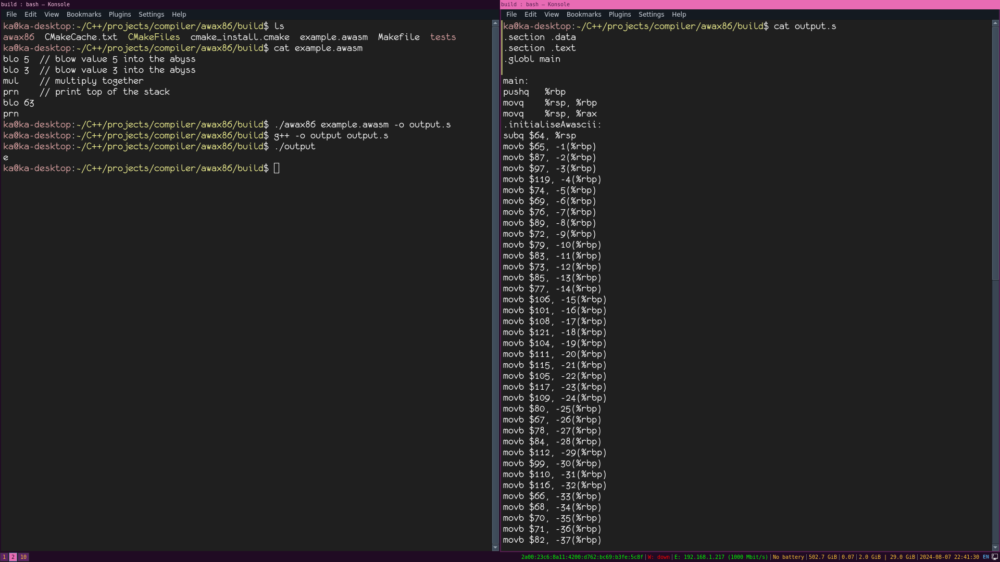

# AWAx86

Experimental ahead of time compiler for the AWA5.0 language, targeting x86.

For more information of AWA5.0, see https://github.com/TempTempai/AWA5.0. 

Currently it is able to compile the example program in the front page of the AWA5.0 documentation:

# Compiler Passes:

There are two frontends for awa5.0, one targeting awatalk and the other targeting awassembly, where I call awassembly the shorthand notation of awatalk.

Awatalk (.awa files) / Awassembly (.awasm files) -> Binary IR -> Tokens -> Backend passes -> X86

# Backend Passes:

TODO
